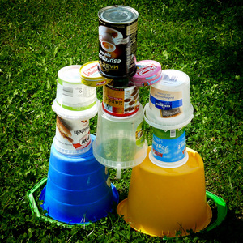
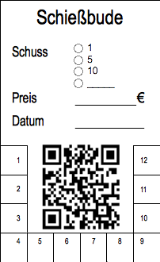

Im Urlaub in Boltenhagen habe ich einen neuen Freund gefunden; er heißt Tom.

Als wir abends zusammen gegrillt haben, hatte Tom eine Idee: Wir können doch eine Schießbude eröffnen, um Geld zu verdienen! Wir haben unsere Sandeimer genommen und eine Pyramide zusammen gebaut.

Wir haben meine Oma gefragt ob sie schießen kommt. Wir haben einige Cents eingenommen.

Als ich aus dem Urlaub zurückgekommen bin, habe ich die Pyramide nochmal in unserem Garten aufgebaut (siehe Bild oben).

Damit ich weiß, wieviel Schuß man gekauft hat,habe ich hier eine Wertkarte(siehe Bild unten),womit ich weiß, wie viel Schuß man noch hat.
